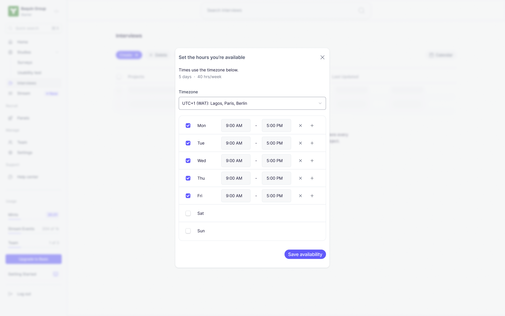
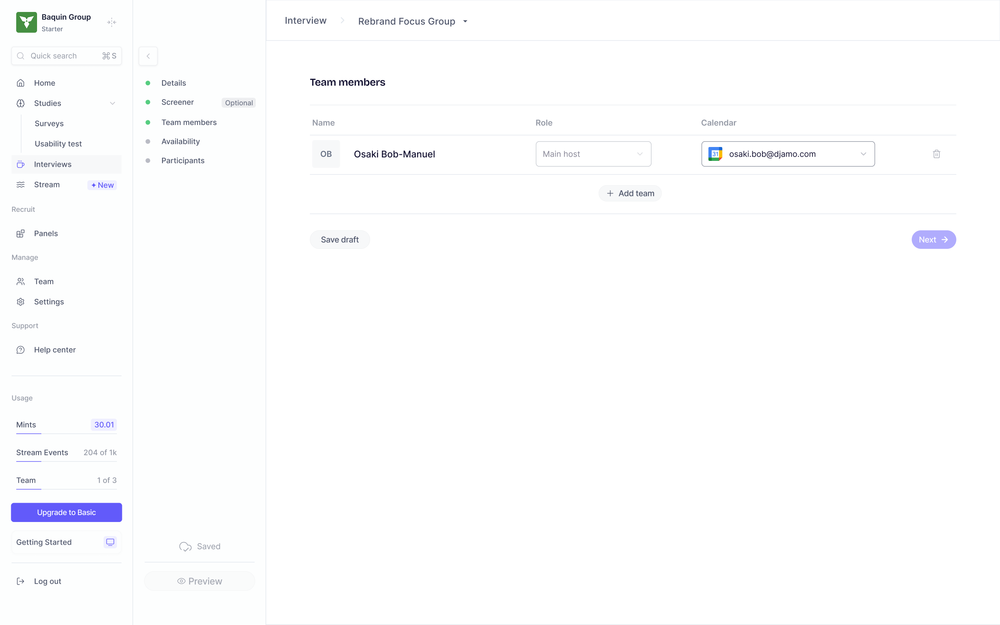
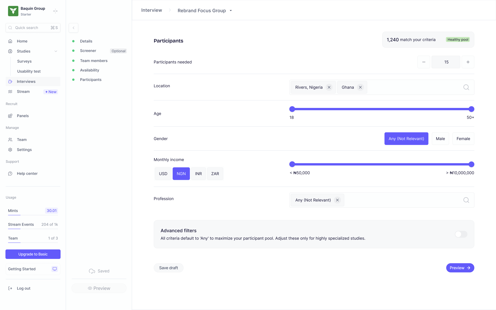
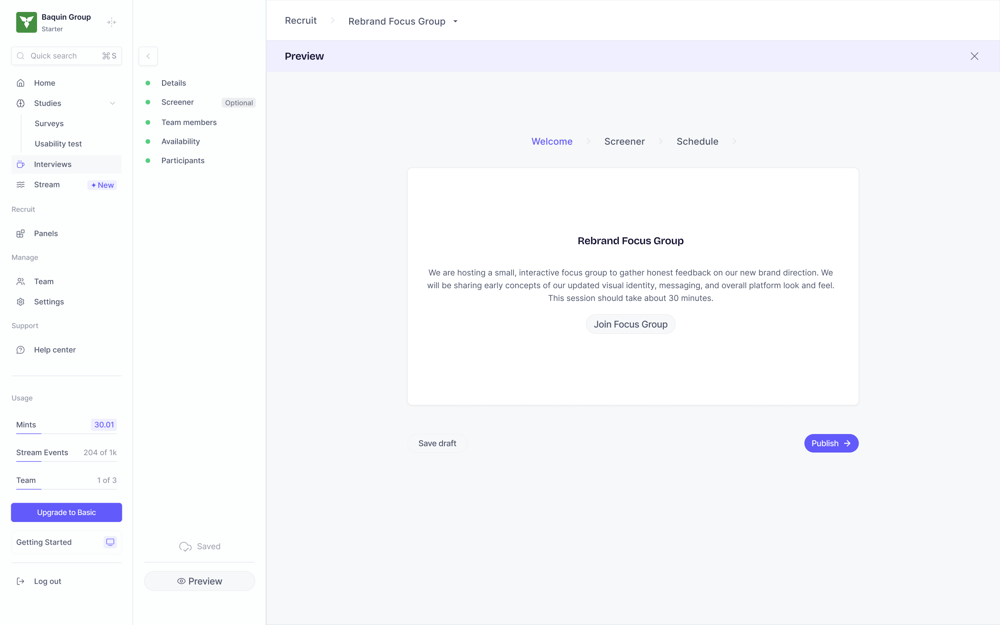
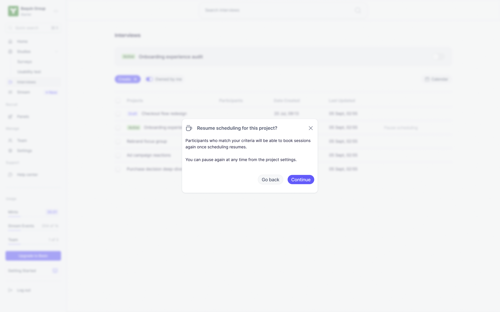
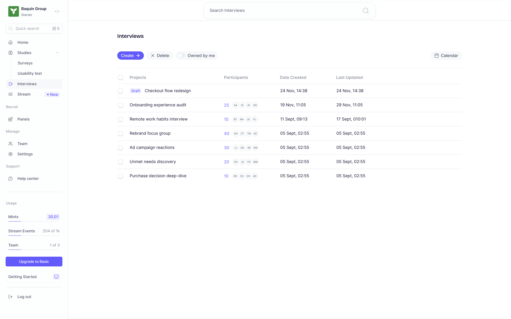
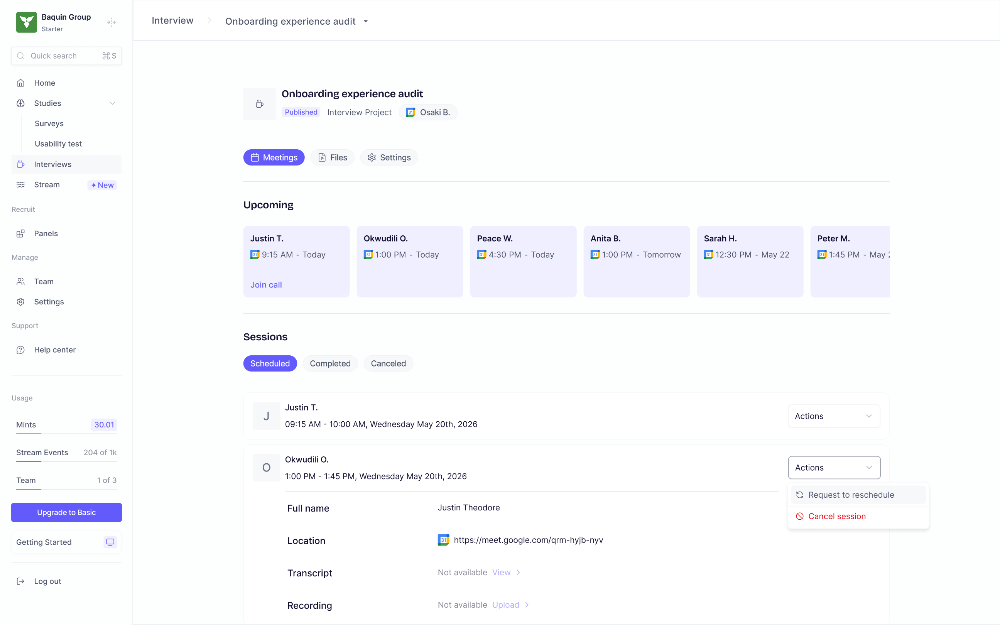
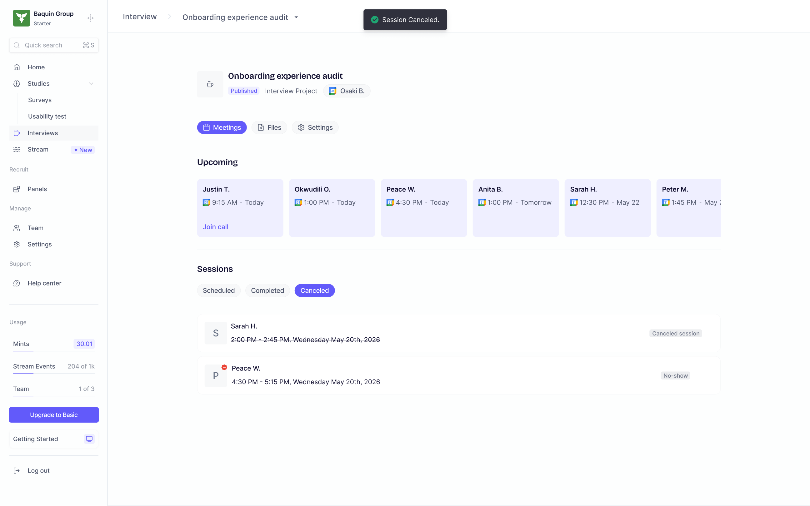

## Overview

Interviews let you recruit and schedule live 1:1 (or moderated) sessions with participants — synced straight to your calendar. You set your availability once, build a study with a screener and targeting criteria, publish it, and matched participants book time directly on your calendar. Every session gets an auto-generated video link, and you manage rescheduling, cancellations, and review from the study's live page.

## Before You Start

- You'll need a Google or Microsoft account to connect your calendar.
- Set aside a few minutes for the one-time setup (calendar connection + availability) before you can create your first study.

## How It Works

### One-Time Setup

1. Click **Interviews** in the left navigation, between **Studies** and **Panels**.

2. If this is your first time here, you'll see a setup checklist instead of a study list. Both steps must be checked off before you can create anything:

   - **Connect Calendar** — click **Connect** and choose Google or Microsoft. This opens that provider's standard OAuth consent screen; sign in and grant Peppermint permission to read/write calendar events. Once connected, this item turns green and Peppermint now knows which calendar to check for conflicts and where to place booked sessions.
   - **Set your availability** — click **Set**. A dialog opens with a timezone dropdown (defaults to your browser's detected timezone) and a weekly schedule editor — one row per day (Mon–Sun), each with a checkbox to enable/disable that day. Enabled days default to 9:00 AM–5:00 PM; adjust the start/end time per block, and use the **+** button next to a row to add more than one time block per day (e.g. 9–12 and 1–5, for a lunch gap). The dialog shows a running total — "X days · Y hrs/week" — so you can sanity-check your availability at a glance. Click **Save availability** to confirm; the checkbox for this step turns green.

   

3. Once both boxes are green, the **Done** button at the bottom of the checklist unlocks. Click it to close the dialog — the **Create** button on the main Interviews page is now clickable (it was previously grayed out).

You only have to do this once. Every interview study you create afterward reuses this same calendar connection, and lets you override the weekly availability per study if needed.

### Creating a Study

1. Click **Create** (top-left of the Interviews list). A dialog opens asking for:
   - **Study Name** — required, internal only; participants never see it.
   - **Location** — Google Calendar or Microsoft Calendar depending on what calendar you have connected.

2. Click **Create** in that dialog. A new draft study is created immediately, and you're dropped into the first step of the wizard, with your study name carried into the breadcrumb at the top.

From here on, every step follows the same rhythm: fill in fields on the left, watch the sidebar on the right, click **Next** (or **Save draft** to stop without advancing). The sidebar shows all 7 steps with a colored dot next to each — green means that step's saved data currently passes validation, yellow means it's incomplete. You can click any step in the sidebar to jump to it directly, in any order. Your work autosaves a couple of seconds after you stop typing — a small indicator at the bottom of the sidebar cycles through "Saving…" → "Saved" (or "Save failed" if something went wrong).

#### Step 1 — Details

- **Study Name** — pre-filled from the create dialog, editable here too.
- **Session Duration** — dropdown: 15 / 30 / 45 / 60 / 90 minutes.
- **Technical requirements** — multi-select dropdown: Desktop, Mobile, Tablet. The trigger button summarizes your picks (e.g. "Desktop and Mobile").
- **Camera checkbox** — check this if participants must have their camera on.
- A note confirms a Google Meet link will be auto-generated per booking — nothing for you to set up there.
- **Welcome Screen** section:
  - **Title** — shown to the participant before they book.
  - **Message** — a rich-text box with formatting tools: bold, italic, underline, bullet/numbered lists, a link inserter (popover — type a URL, hit Apply), an image uploader (files under 5MB, dropped inline into the message), and a text-color picker (8×10 swatch grid).
  - **Start button text** — the literal label on the button participants click to begin. Set your own rather than leaving it blank.

Click **Next** to save and move to Screener. If Study Name, Session Duration, Welcome Title, Welcome Message, or Start Button Text are missing, **Next** is disabled and the empty fields show a red error instead of gray helper text.

#### Step 2 — Screener (optional)

Skip this step if your **Participants** targeting (Step 5) already narrows things down enough — screener questions are best used for behavioural filtering (habits, attitudes, past experience) rather than demographic filtering, which Participants targeting already handles.

- Click **+ Add question** to add as many screener questions as you need.
- Choose a **question type** — single-select or multi-select — then type in the question and its answer options.
- Mark the qualifying option(s): single-select questions take one qualifying answer, multi-select questions can have several, so Peppermint can auto-flag whether a respondent qualified.
- Drag the handle on a card to reorder it, or click the trash icon to delete it.

Nothing here is required — **Next** is never blocked by this step. If you never add a real question, screening is simply skipped for this study.

#### Step 3 — Team

- A table lists everyone on the study: you (**Main host**, locked — can't be changed or removed), plus anyone else you add.
- Each row has a **Role** dropdown (Main host / Observer) and a **Calendar** dropdown showing which of that person's connected calendars sessions will be added to (or "Not connected" if they haven't linked one).
- Click **Add team** to open a picker of everyone in your workspace — check the people you want, then click **Add team** in that dialog to confirm. They're added as Observers by default; change their role afterward in the table.
- Click the trash icon on a row to remove someone.

Click **Next** to move on — nothing here blocks progress either.

#### Step 4 — Availability

This is study-specific availability — separate from (but pre-filled from) the one-time setup.

- **Start date / End date** — the booking window, via a calendar date-picker.
- **Timezone**, **Buffer before session**, **Buffer after session**, **Minimum notice** — all dropdowns.
- A weekly schedule editor identical in style to the setup one — toggle days on/off, set time blocks per day.
- A calendar preview next to it highlights which dates fall on your enabled weekdays, so you can visually confirm your blocks line up with the date range you picked.

**Next** is blocked until you've set a start date, an end date, and at least one real time block.

#### Step 5 — Participants

- **Participants needed** — a stepper (−/+ or type a number directly), floor of 5.
- **Location** — a tag search box: type to search, click a suggestion to add it as a chip, click the × to remove it. Leave it empty and Peppermint broadcasts to everyone regardless of location rather than matching zero people.
- **Age range** — a dual-handle slider (18–50+).
- **Gender**, **Marital status**, **Dependents**, **Tech proficiency** — single-choice chip rows, each defaulting to "Any (Not Relevant)".
- **Income range** — pick a currency (USD/NGN/INR/ZAR), then a dual-handle slider scaled to that currency.
- **Profession** — another tag search box, same interaction as Location.
- **Advanced filters** toggle — reveals Education level and Disability status (multi-select dropdowns), plus Marital status/Dependents/Tech proficiency (already visible above) and a Hobbies tag search. When on, Education and Disability status each require at least one real selection (or explicitly choosing "Any (Not Relevant)").

Click **Preview** — this step's button is labeled differently, since it's the last one before the dry run.

#### Step 6 — Preview

A full simulation of the participant experience, styled exactly like what they'll see:

- A phase breadcrumb (**Welcome → Screener → Schedule**) you can click through manually.
- **Welcome** — your title, formatted message (images and all), and start button rendered as written.
- **Screener** — your questions, exactly as a participant would answer them (not submittable here — it's a preview).
- **Schedule** — a real calendar + time-slot picker mock, showing how your availability translates into bookable slots.
- A final **Confirmed** screen showing what a booking confirmation looks like.

At the bottom: **Save draft** (leaves it as a draft, exits) or **Publish**.

#### Step 7 — Publish

Clicking **Publish** first checks that every required step (Details, Availability, Participants — Screener and Team have no hard requirements) is complete. If something's missing, a toast names exactly which step(s) still need attention, and nothing is published.

If everything checks out, a "Ready to recruit?" confirmation dialog explains that matched participants will now be able to view your availability and book, and that your settings stay editable afterward. Click **Continue** to confirm (or **Go back** to cancel).

On success, you land on the study's live page with a one-time toast: "Matched participants can now view your availability and book a session."

### Running a Live Study

Once published, clicking into the study from your Interviews list shows a header with the study name, status badge, host, and three tabs: **Meetings**, **Files**, **Settings**.

#### The Meetings Tab

- **Upcoming** — a horizontally-scrolling strip of cards, one per booked-but-not-yet-happened session, each showing the participant's name and time, with a **Join call** link on the very next one.
- **Sessions**, in three tabs:
  - **Scheduled** — every booked, still-upcoming session. Click a row to expand it and see full details (participant name, location/meeting link, transcript/recording — grayed out until the session's happened). Use the **Actions** menu to **Request reschedule** (dialog, optional reason, sends the request) or **Cancel session** (same pattern, with a note that this can't be undone).
  - **Completed** — sessions that have already happened. If any need your attention (status: scored, transcript-received, or unverified — meaning a transcript/scoring came back but nobody's signed off yet), a banner reads "N sessions need your attention" and warns that unreviewed sessions auto-approve after 5 days. Rows needing review show a red dot on their **Actions** menu; open it to **Mark as complete** (confirms via a dialog showing the participant and session time), **Mark as no-show**, or **Request reschedule**. Resolved rows show a green checkmark badge instead of an Actions menu.
  - **Canceled** — cancellations and no-shows land here together, each labeled accordingly.
- Click into any completed/scheduled row's expanded view to jump to that participant's screener response if they answered one — step through multiple participants' responses with prev/next arrows without closing the panel.

### Pausing Scheduling

From the Interviews list, active studies show a **Pause scheduling** link. Clicking it opens a confirmation dialog explaining that no new sessions will be booked while scheduling is paused, and that participants who have already confirmed a session will not be affected. Click **Continue** to confirm; the study flips to paused and the link becomes **Resume scheduling**. Clicking **Resume scheduling** opens a similar dialog — confirm, and matched participants can book again immediately.

### The Interviews List

The Interviews list is your central hub for all interview projects. Each row shows the project name, a status badge (**Draft** or **Active**), participant count with avatar chips, date created, and last updated.

- **Owned by me** — a toggle at the top of the list. When on, you only see studies you created. Turn it off to see every study across your team — useful if you're an observer on someone else's project or need a full picture of what's running.
- **Search Interviews** — a search bar at the top of the page to find specific projects by name.
- **Delete** — select one or more projects using the checkboxes, then click **Delete** to remove them.

#### Weekly Calendar

Click the **Calendar** button (top-right of the Interviews list) to open a sidebar showing your upcoming sessions in a weekly view. Each entry shows the participant's name, study name, session time, and a **Camera required** tag if camera was set as a requirement. If a participant completed a screener, a **View screener** link appears next to their entry — click it to open the **Screener Response** panel without leaving the calendar.

The calendar is scoped to the study selected in the list banner at the top. Navigate weeks using the left/right arrows.

#### Viewing Screener Responses

From the Weekly Calendar sidebar or from a session row inside a study, you can open a participant's **Screener Response** panel. This shows each screener question the participant answered, their response, and a **Qualified** tag on answers that matched your qualifying criteria. Use the left/right arrows at the top of the panel to step through different participants' responses without closing it.

### The Files Tab

Inside a published study, the **Files** tab gives you access to recordings, transcripts, and AI-generated summaries for every completed session.

The left side lists all participants with their session date. Participants with a completed recording show a duration badge (e.g. "45:02") next to their name. Click any participant to open their **Recap** panel on the right.

#### Recap Panel

The Recap panel has three sections:

- **Recording** — a video player showing the session recording. Use the left/right arrows at the top to navigate between participants without closing the panel.
- **Transcript** — a collapsible section containing the full session transcript, timestamped and labeled by speaker (e.g. "Researcher 00:00", "Justin T. 00:06"). Click the section header to expand or collapse it.
- **Summary** — an AI-generated overview of the session, written in paragraph form. This captures the key themes, participant attitudes, and notable moments from the conversation.
- **Key Insights** — a bullet-point list of the most significant findings from the session, extracted automatically. Each insight is a standalone observation you can use directly in your research synthesis.

## Key Actions

- **Create** — Start a new interview study (unlocks only after calendar connection + availability setup is complete).
- **Connect** — Link your Google or Microsoft Calendar so Peppermint can check conflicts and place booked sessions.
- **Set availability** — Define your recurring weekly working hours for scheduling.
- **Add team** — Add teammates as Main host or Observer, each with their own connected calendar.
- **Publish** — Make a study live so matched participants can book sessions.
- **Pause scheduling / Resume scheduling** — Temporarily stop or resume accepting new bookings without unpublishing the study.
- **Request reschedule** — Ask a participant to pick a new time for a booked session.
- **Cancel session** — Cancel a booked session (cannot be undone).
- **Mark as complete / Mark as no-show** — Resolve a completed session that needs review.
- **Owned by me** — Toggle the project list between only your studies and all studies across your team.
- **Calendar** — Open the Weekly Calendar sidebar to see all upcoming sessions at a glance.
- **View screener** — Open a participant's screener responses from the calendar or a session row.

## Tips & Best Practices

- Complete the one-time calendar connection and availability setup before your team tries to create a study — the **Create** button stays disabled until both checklist items are green.
- Use the sidebar's colored dots (green/yellow) while building a study to spot incomplete steps at a glance, rather than clicking **Next** repeatedly to discover what's missing.
- Screener and Team steps never block progress — if your Participants targeting (Step 5) is precise enough, you can safely skip building a screener.
- Review completed sessions promptly — unreviewed sessions auto-approve after 5 days, so don't let the "N sessions need your attention" banner pile up.
- Use **Pause scheduling** instead of unpublishing when you need to temporarily stop bookings — it preserves existing sessions and lets you resume without rebuilding the study.
- Check the **Files** tab after sessions complete — the AI-generated Summary and Key Insights can save significant synthesis time, and you can always cross-reference them against the full transcript.
- Use the **Weekly Calendar** sidebar to get a quick overview of your upcoming sessions across studies without clicking into each one individually.

## What Happens Next

Once your study is published, matched participants can view your availability and book sessions directly. Sessions flow into the **Meetings** tab as they're booked, completed, or canceled, and any teammates added to the study can join as Observers on their own connected calendar. After sessions are completed and reviewed, head to the **Files** tab to access recordings, transcripts, and AI-generated summaries for each participant.

See also: [Panels](/features/panels)

## FAQs & Common Issues

**Q: Why is the Create button grayed out on the Interviews page?**
A: You haven't finished the one-time setup yet. Both **Connect Calendar** and **Set your availability** must be checked off (green) before **Create** unlocks.

**Q: Can I use Microsoft Calendar instead of Google?**
A: Yes — during setup, click **Connect** and choose whichever calendar provider you use. Which calendar a study books to depends on the calendar you've connected.

**Q: Do I need to add screener questions?**
A: No. The Screener step is optional and never blocks progress. If your Participants targeting criteria already narrows the pool enough, you can skip it entirely.

**Q: What happens if I don't review a completed session?**
A: Unreviewed sessions (scored, transcript-received, or unverified) auto-approve after 5 days. A banner on the Completed tab tracks how many sessions currently need your attention.

**Q: What's the difference between pausing and canceling a study?**
A: Pausing (**Pause scheduling**) stops new bookings but keeps the study published and preserves existing sessions — you can resume anytime. Canceling a session removes that individual booking and cannot be undone.

**Q: Can I change my study's availability after publishing?**
A: Yes — study settings, including availability, stay editable after publishing. The confirmation dialog on Publish explicitly notes this.

**Q: Where do I find session recordings and transcripts?**
A: Inside a published study, click the **Files** tab. Select a participant from the list on the left to open their Recap panel, which includes the video recording, a timestamped transcript, and an AI-generated summary with key insights.

**Q: Can I see all my upcoming sessions in one place?**
A: Yes — click the **Calendar** button in the top-right of the Interviews list to open the Weekly Calendar sidebar. It shows all upcoming sessions across the selected study, with participant names, times, and quick links to view screener responses.

**Q: What does the "Owned by me" toggle do?**
A: When toggled on, the Interviews list only shows studies you created. Turn it off to see all studies across your team, including ones where you're added as an observer.
